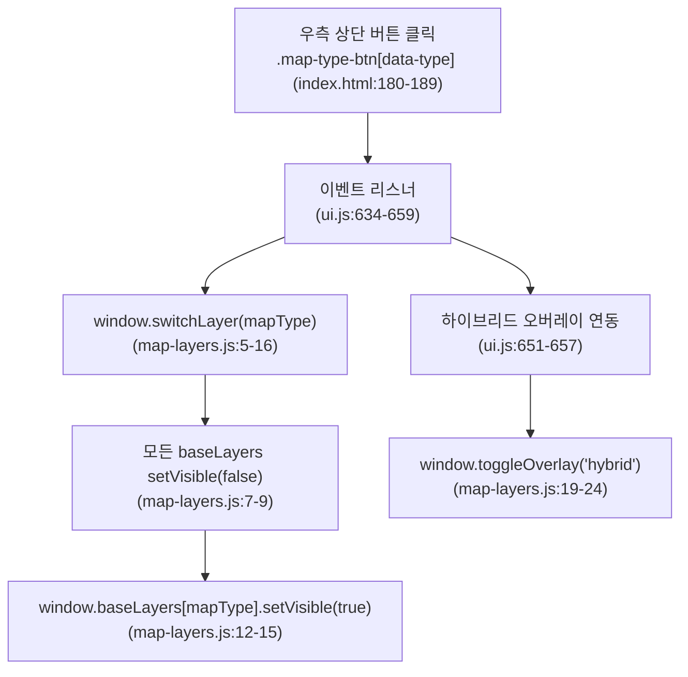
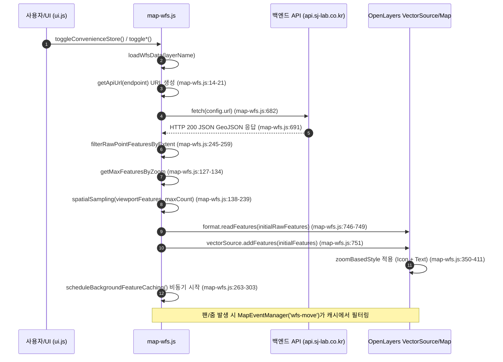

# 지도 가시화(렌더링) 분석 보고서

본 문서는 `sj-lab-mapservice` 저장소의 지도 가시화 및 렌더링 파이프라인 전반을 정적 분석한 기술 보고서입니다. OpenLayers 기반 맵/뷰 구성, VWorld 배경지도, GeoServer WMS, 자사 백엔드 WFS 레이어 로딩 및 공간 샘플링, UI 이벤트 연동, 좌표계 처리 및 렌더링 최적화/버그 가능성을 상세히 다룹니다.

---

## 목차

1. [레이어 전체 목록](#1-레이어-전체-목록)
2. [배경지도 전환과 오버레이 토글 흐름](#2-배경지도-전환과-오버레이-토글-흐름)
3. [WFS 레이어 표시 파이프라인](#3-wfs-레이어-표시-파이프라인)
4. [성능 옵션의 위치와 의도](#4-성능-옵션의-위치와-의도)
5. [POI 아이콘 스타일 규칙 준수 여부](#5-poi-아이콘-스타일-규칙-준수-여부)
6. [featureProjection 및 좌표계 처리 방식과 위험 지점](#6-featureprojection-및-좌표계-처리-방식과-위험-지점)
7. [렌더링 관련 버그 가능성과 개선 제안](#7-렌더링-관련-버그-가능성과-개선-제안)

---

## 1. 레이어 전체 목록

시스템에 정의된 모든 지도 레이어(배경지도, WMS, WFS 벡터 레이어)의 상세 제원입니다.

| 레이어 키 | 레이어 명칭 | 레이어 종류 | 소스 URL 패턴 | zIndex | 기본 visible | 생성 위치 (file:line) | 설정/정의 위치 (file:line) | 비고 |
| :--- | :--- | :--- | :--- | :--- | :--- | :--- | :--- | :--- |
| `common` | 일반 지도 | XYZ (`ol.layer.Tile`) | `https://xdworld.vworld.kr/2d/Base/service/{z}/{x}/{y}.png` | 미지정 (기본값 0) | `true` | `js/modules/map/map-core.js:11-20` | `map-core.js:10-20` | VWorld 2D 기본 배경지도 |
| `satellite` | 위성 영상 | XYZ (`ol.layer.Tile`) | `https://xdworld.vworld.kr/2d/Satellite/service/{z}/{x}/{y}.jpeg` | 미지정 (기본값 0) | `false` | `js/modules/map/map-core.js:21-30` | `map-core.js:21-30` | VWorld 항공/위성 영상 |
| `hybrid` | 하이브리드 오버레이 | XYZ (`ol.layer.Tile`) | `https://xdworld.vworld.kr/2d/Hybrid/service/{z}/{x}/{y}.png` | 미지정 (기본값 0) | `false` | `js/modules/map/map-core.js:34-44` | `map-core.js:33-44` | 위성 영상용 도로/행정경계 오버레이 |
| `convenience_store` (WMS) | 편의점 (WMS) | WMS 타일 (`ol.layer.Tile`, `TileWMS`) | `https://geoserver.sj-lab.co.kr/geoserver/ne/wms` (`ne:convenience_store`) | `1000` (`map-wms.js:55`) | `false` | `js/modules/map/map-wms.js:46-55` | `map-wms.js:10-18` (`WMS_CONFIG`) | GeoServer WMS 1.1.0 래스터 타일 |
| `convenience_store` (WFS) | 편의점 | Vector (`ol.layer.Vector`, `VectorSource`) | `getApiUrl("/map/convenience-store")`<br>dev: `:8100`, prod: `api.sj-lab.co.kr` | `1000` (`map-wfs.js:422`) | `false` | `js/modules/map/map-wfs.js:414-427` | `map-wfs.js:25-40` (`WFS_CONFIG`) | 자사 백엔드 POI 벡터 레이어 |
| `bus_stop` | 버스정류장 | Vector (`ol.layer.Vector`, `VectorSource`) | `getApiUrl("/map/busStop-info")` | `1000` (`map-wfs.js:422`) | `false` | `js/modules/map/map-wfs.js:414-427` | `map-wfs.js:41-56` (`WFS_CONFIG`) | 자사 백엔드 POI 벡터 레이어 |
| `cctv` | CCTV | Vector (`ol.layer.Vector`, `VectorSource`) | `getApiUrl("/map/cctv-info")` | `1000` (`map-wfs.js:422`) | `false` | `js/modules/map/map-wfs.js:414-427` | `map-wfs.js:57-72` (`WFS_CONFIG`) | HLS 비디오 스트리밍 팝업 연동 |
| `pharmacy` | 약국 | Vector (`ol.layer.Vector`, `VectorSource`) | `getApiUrl("/map/pharmacy-info")` | `1000` (`map-wfs.js:422`) | `false` | `js/modules/map/map-wfs.js:414-427` | `map-wfs.js:73-88` (`WFS_CONFIG`) | 운영시간 상세 팝업 제공 |
| `hospital` | 병원 | Vector (`ol.layer.Vector`, `VectorSource`) | `getApiUrl("/map/hospital-info")` | `1000` (`map-wfs.js:422`) | `false` | `js/modules/map/map-wfs.js:414-427` | `map-wfs.js:89-104` (`WFS_CONFIG`) | 응급실/분류/운영시간 팝업 제공 |
| `government_office` | 관공서 | Vector (`ol.layer.Vector`, `VectorSource`) | `getApiUrl("/map/governmentOffice-info")` | `1000` (`map-wfs.js:422`) | `false` | `js/modules/map/map-wfs.js:414-427` | `map-wfs.js:105-120` (`WFS_CONFIG`) | 자사 백엔드 POI 벡터 레이어 |

> **참고 (타 모듈 벡터 레이어)**:
> - `measureLayer` (`js/modules/map/map-measure.js:66-79`): `zIndex: 1000`, 측정 도구용 벡터 레이어
> - `tempRectangle`, `selectionRectangle` (`js/modules/map/map-area-selector.js:232, 293`): `zIndex: 200`, 영역 선택 캡처용 벡터 레이어

---

## 2. 배경지도 전환과 오버레이 토글 흐름

사용자 인터페이스(UI) 상호작용이 어떤 함수를 호출하고 최종적으로 레이어의 `setVisible` 상태를 어떻게 변경하는지 단계별로 정리합니다.

### 2.1 배경지도 전환 흐름



1. **사용자 액션**:
   - 우측 상단 배경지도 선택 버튼 클릭: `index.html:181` (`data-type="common"`), `index.html:185` (`data-type="satellite"`)
   - (참고: `ui.js:250-256`에 `input[name="background"]` 라디오 이벤트 핸들러도 구현되어 있으나 `index.html:362-373` 레이어 탭 마크업에는 미배치 상태)
2. **이벤트 핸들러 실행**:
   - `js/modules/ui.js:636-659`의 `click` 핸들러가 트리거됨.
   - 버튼 스타일 갱신: 모든 `.map-type-btn`에서 `.active` 제거 후 클릭된 버튼에 `.active` 추가 (`ui.js:641, 644`).
   - `window.switchLayer(mapType)` 호출 (`ui.js:648`).
3. **핵심 함수 실행 (`switchLayer`)**:
   - `js/modules/map/map-layers.js:5-16`:
     - 모든 배경 레이어 비활성화: `Object.values(window.baseLayers).forEach((layer) => layer.setVisible(false));` (`map-layers.js:7-9`).
     - 선택된 레이어 활성화: `window.baseLayers[layerType].setVisible(true);` 및 `currentLayer = layerType;` (`map-layers.js:12-15`).
4. **하이브리드 연동**:
   - 위성 선택 시: `ui.js:652-654`에서 `window.toggleOverlay("hybrid")` 호출.
   - 일반 지도 선택 시: `ui.js:654-657`에서 `window.toggleOverlay("hybrid")` 호출.

---

### 2.2 오버레이 토글 흐름

#### A. VWorld 하이브리드 오버레이 토글
- **함수**: `toggleOverlay(overlayType)` (`js/modules/map/map-layers.js:19-24`)
- **로직**: `window.overlayLayers[overlayType].setVisible(!isVisible)`로 불리언 반전.

#### B. GeoServer WMS 레이어 토글
- **함수**: `toggleWmsLayer(layerName)` (`js/modules/map/map-wms.js:146-171`)
- **로직**:
  - `layer.setVisible(!isVisible);` 및 `wmsActive[layerName] = !isVisible;` (`map-wms.js:156-157`).
  - 활성화(`!isVisible === true`) 시 타일 소스 새로고침: `source.refresh();` (`map-wms.js:160-166`).
  - WFS 편의점 활성화 시 상호 배제를 위해 `toggleWmsLayer("convenience_store")`가 자동 호출됨 (`map-wfs.js:857`).

#### C. 자사 백엔드 WFS 레이어 토글 (6종)
- **UI 마크업 구조**:
  - 편의시설 트리거 버튼: `#wfsAmenitiesBtn` (`index.html:207-213`) `onclick="toggleAmenitiesSubmenu();"`
    - 서브메뉴: `#amenitiesSubmenu` (`index.html:230-255`)
    - 편의점: `[data-amenities="nearbyConvenience"]` (`index.html:231`)
    - 약국: `[data-amenity="pharmacy"]` (`index.html:237`)
    - 병원: `[data-amenity="hospital"]` (`index.html:243`)
    - 관공서: `[data-amenity="government_office"]` (`index.html:249`)
  - 교통 트리거 버튼: `#wfsTransportBtn` (`index.html:215-221`) `onclick="toggleTransportSubmenu();"`
    - 서브메뉴: `#transportSubmenu` (`index.html:259-272`)
    - 버스: `[data-transport="bus"]` (`index.html:260`)
    - CCTV: `[data-transport="cctv"]` (`index.html:266`)
- **이벤트 라우팅 (`js/modules/ui.js:409-555`)**:
  - 서브메뉴 아이템 클릭 시 각 전용 토글 함수 호출:
    - 버스: `window.toggleBusStop()` (`ui.js:442` -> `map-wfs.js:894-948`)
    - CCTV: `window.toggleCctv()` (`ui.js:466` -> `map-wfs.js:951-1005`)
    - 편의점: `window.toggleConvenienceStore()` (`ui.js:485` -> `map-wfs.js:834-891`)
    - 약국: `window.togglePharmacy()` (`ui.js:527` -> `map-wfs.js:1008-1073`)
    - 병원: `window.toggleHospital()` (`ui.js:537` -> `map-wfs.js:1076-1141`)
    - 관공서: `window.toggleGovernmentOffice()` (`ui.js:547` -> `map-wfs.js:1144-1213`)
- **공통 토글 동작 방식**:
  - 레이어가 비활성(`visible === false`) 상태인 경우:
    - `loadWfsData(layerName)` 호출 (`map-wfs.js:842, 902, 960, 1022, 1090, 1159`).
    - 로딩 성공 후 `layer.setVisible(true)` 및 `wfsActive[layerName] = true`.
    - WMS 편의점이 켜져 있다면 WMS 해제 (`map-wfs.js:857`).
    - 버튼에 `.active` 클래스 추가.
  - 레이어가 활성(`visible === true`) 상태인 경우:
    - `layer.setVisible(false)` 및 `wfsActive[layerName] = false`.
    - 버튼에서 `.active` 클래스 제거.

---

## 3. WFS 레이어 표시 파이프라인

WFS 데이터가 서버에 요청되어 최종적으로 화면에 렌더링되고 캐싱되는 전 과정입니다.



### 단계별 상세 분석 및 근거

| 단계 | 처리 내용 | 주요 함수 / 식별자 | file:line 근거 |
| :---: | :--- | :--- | :--- |
| **1** | **요청 URL 생성** | `getApiUrl(endpoint)`<br>`location.hostname` 검사 후 `http://localhost:8100` 또는 `https://api.sj-lab.co.kr` 선택 | `js/modules/map/map-wfs.js:14-21`<br>`WFS_CONFIG` 정의: `map-wfs.js:24-121` |
| **2** | **네트워크 요청 & 로딩 UI** | `fetch(config.url)` 호출, 점진적 진행률 바 타이머(300ms 간격 progress 증가), 로딩 문구 노출 | `js/modules/map/map-wfs.js:669-682`<br>`showLoadingMessage`: `map-wfs.js:1949-1996`<br>`updateLoadingProgress`: `map-wfs.js:2007-2027` |
| **3** | **응답 수신 & 원본 피처 추출** | `response.json()` 파싱 후 `data.features` 배열 추출 (`rawFeatures`) | `js/modules/map/map-wfs.js:683-706` |
| **4** | **뷰포트 사전 필터** | `filterRawPointFeaturesByExtent(rawFeatures, currentExtent)`<br>OL Feature 객체 생성 전 원본 GeoJSON Point의 [x, y]가 뷰포트 extent 범위 내에 있는지 비교 | `js/modules/map/map-wfs.js:245-259`<br>호출부: `map-wfs.js:718-721` |
| **5** | **줌별 최대 표출 개수 산출** | `getMaxFeaturesByZoom(zoomLevel)`<br>- zoom ≥ 18: 3000개<br>- zoom 16~17: 1500개<br>- zoom 14~15: 800개<br>- zoom 12~13: 400개<br>- zoom 10~11: 200개<br>- zoom < 10: 100개 | `js/modules/map/map-wfs.js:127-134`<br>호출부: `map-wfs.js:716` |
| **6** | **공간 균등 샘플링** | `spatialSampling(features, maxCount, extent, getCoordinates)`<br>뷰포트를 `gridCols * gridRows` 그리드로 분할하여 셀별로 균등 추출 (밀집 편향 방지) | `js/modules/map/map-wfs.js:138-239`<br>호출부: `map-wfs.js:725-731`<br>폴백 가드 (0개 시 전체 폴백): `map-wfs.js:734-738` |
| **7** | **Feature 파싱 (readFeatures)** | `format.readFeatures({ type: 'FeatureCollection', features: initialRawFeatures }, { dataProjection: 'EPSG:4326', featureProjection })`<br>※ `featureProjection`은 `vectorSource.getProjection()`(= `null`) 유지 | `js/modules/map/map-wfs.js:703, 746-749` |
| **8** | **벡터 소스 추가 & 초기 캐시** | `vectorSource.addFeatures(initialFeatures)`로 화면 표출<br>`wfsDataCache[layerName] = initialFeatures.slice()` 저장<br>`wfsDataLoaded[layerName] = true` | `js/modules/map/map-wfs.js:751-755` |
| **9** | **스타일 렌더링** | `zoomBasedStyle(feature)` 실행<br>- 아이콘: `config.style.image.getSrc()`, anchor [0.5, 1.0], size [32, 32]<br>- 텍스트 라벨: 줌 레벨 14 이상에서만 속성명 표시 | `js/modules/map/map-wfs.js:350-411`<br>아이콘: `map-wfs.js:374-386`<br>라벨: `map-wfs.js:388-408` |
| **10** | **백그라운드 캐싱** | `scheduleBackgroundFeatureCaching(...)`<br>`requestIdleCallback` (미지원 시 `setTimeout(..., 16)`)을 사용해 미표시 잔여 피처를 1000개씩 청크 파싱하여 `wfsDataCache[layerName]`에 누적 | `js/modules/map/map-wfs.js:263-303`<br>호출부: `map-wfs.js:779-784` |
| **11** | **지도 이동/줌 연동** | `MapEventManager.registerMoveHandler('wfs-move-${layerName}', ...)`<br>500ms 쿨다운 체크 후 `wfsDataCache`에서 뷰포트 교차(`intersectsExtent`) 및 `getMaxFeaturesByZoom` + `spatialSampling` 재수행 후 `vectorSource` 갱신 | `js/modules/map/map-wfs.js:446-522`<br>쿨다운: `map-wfs.js:451-454`<br>샘플링: `map-wfs.js:498-502` |

---

## 4. 성능 옵션의 위치와 의도

코드베이스에 적용된 주요 성능 최적화 옵션의 설정 위치와 설계 의도입니다.

```
+-----------------------------------------------------------------------------------+
| OpenLayers Rendering Pipeline                                                    |
|                                                                                   |
|  [User Pan/Zoom Animation] ----> updateWhileAnimating: false (렌더링 일시중지)     |
|  [Mouse Drag/Wheel]        ----> updateWhileInteracting: false (상호작용 중단 시 렌더링) |
|                                                                                   |
|  [Vector Layer Rendering]  ----> declutter: true (겹치는 라벨/아이콘 자동 은폐)     |
|                            ----> renderBuffer: 100 (화면 밖 100px 사전 렌더링)       |
|                                                                                   |
|  [WMS Tile Source]         ----> TILED: true (256x256 타일 분할 캐싱)             |
|                            ----> BUFFER: 50 (타일 경계 심볼 잘림 방지 50px)          |
|                            ----> FEATURE_COUNT: 10/1 (GetFeatureInfo 패킷 최소화)  |
+-----------------------------------------------------------------------------------+
```

| 옵션명 | 설정 값 | 적용 모듈 및 위치 (file:line) | 대상 레이어/소스 | 설계 의도 |
| :--- | :---: | :--- | :--- | :--- |
| `updateWhileAnimating` | `false` | `js/modules/map/map-wms.js:50`<br>`js/modules/map/map-wfs.js:419` | WMS 타일 레이어 (`ol.layer.Tile`)<br>WFS 벡터 레이어 (`ol.layer.Vector`) | 지도 줌 인/아웃 또는 `flyTo` 등의 뷰 애니메이션 진행 중 매 프레임 레이어를 재렌더링하지 않음으로써 프레임 드랍(stuttering)을 없애고 부드러운 60fps 애니메이션을 유지함. |
| `updateWhileInteracting` | `false` | `js/modules/map/map-wms.js:51`<br>`js/modules/map/map-wfs.js:420` | WMS 타일 레이어 (`ol.layer.Tile`)<br>WFS 벡터 레이어 (`ol.layer.Vector`) | 마우스 드래그(DragPan), 휠 회전(MouseWheelZoom) 등 사용자의 능동적 인터랙션 도중 레이어 재계산 및 렌더링을 억제하여 즉각적인 UI 조작 반응성을 확보함. |
| `declutter` | `true` | `js/modules/map/map-wfs.js:421` | WFS 벡터 레이어 (`ol.layer.Vector`) | POI 아이콘과 텍스트 라벨이 밀집되어 겹칠 때 OpenLayers 자체 충돌 감지 엔진을 통해 가독성을 해치는 심볼/라벨을 숨겨 화면 번잡함을 방지하고 Canvas 렌더링 부하를 감소시킴. |
| `TILED` | `true` | `js/modules/map/map-wms.js:37` | WMS 소스 (`ol.source.TileWMS` params) | GeoServer WMS 요청 시 단일 전체 뷰 이미지(Single Tile)가 아닌 256×256 타일 그리드 단위로 요청하도록 지정하여, 브라우저 캐시 및 서버 타일 캐시(GeoWebCache) 활용도를 극대화하고 병렬 다운로드를 실현함. |
| `BUFFER` | `50` | `js/modules/map/map-wms.js:38` | WMS 소스 (`ol.source.TileWMS` params) | GeoServer 렌더링 시 타일 경계 주변으로 50픽셀의 여유 버퍼를 두어, 타일 경계선에 걸친 심볼이나 텍스트 라벨이 잘려나가는 아티팩트(seams)를 방지함. |
| `BUFFER` | `5` | `js/modules/map/map-wms.js:89, 126` | WMS GetFeatureInfo 요청 파라미터 | 단일 클릭 및 마우스 오버 시 피처 질의 반경을 5픽셀로 좁혀 불필요한 인접 피처 검색을 차단하고 정확한 타겟팅과 빠른 응답을 유도함. |
| `FEATURE_COUNT` | `10` | `js/modules/map/map-wms.js:39` | WMS 소스 (`ol.source.TileWMS` params) | WMS 서비스 파라미터의 기본 피처 수 상한을 설정함. |
| `FEATURE_COUNT` | `1` | `js/modules/map/map-wms.js:86, 124` | WMS GetFeatureInfo 요청 파라미터 | 클릭 팝업 및 마우스 오버 판정 시 GeoServer로부터 단 1개의 피처만 수신하여 네트워크 페이로드와 클라이언트 JSON 파싱 비용을 최소화함. |
| `renderBuffer` | `100` | `js/modules/map/map-wfs.js:418` | WFS 벡터 레이어 (`ol.layer.Vector`) | 뷰포트 외곽 100픽셀 영역까지 미리 렌더링 버퍼를 확보하여 미세한 드래그 이동 시 아이콘이 갑자기 튀어나오는 깜빡임(pop-in) 현상을 방지함. |

---

## 5. POI 아이콘 스타일 규칙 준수 여부

프로젝트 컨벤션(`docs/map-architecture.md:21`)에 명시된 POI 아이콘 표준:
- `size: [32, 32]` (표시 크기)
- `imgSize: [32, 32]` (원본 이미지 크기)
- `anchor: [0.5, 1.0]` (하단 중앙 정렬)

### 레이어별 준수 현황표

| 레이어 키 | 레이어 명칭 | WFS_CONFIG 정의 (size / imgSize / anchor) | 동적 zoomBasedStyle (size / imgSize / anchor) | 규칙 준수 여부 | 확인 근거 (file:line) |
| :--- | :--- | :---: | :---: | :---: | :--- |
| `convenience_store` | 편의점 | `[32, 32]` / `[32, 32]` / `[0.5, 1.0]` | `[32, 32]` / `[32, 32]` / `[0.5, 1.0]` | **완전 준수** | `map-wfs.js:32, 36, 37`<br>`map-wfs.js:378, 382, 383` |
| `bus_stop` | 버스정류장 | `[32, 32]` / `[32, 32]` / `[0.5, 1.0]` | `[32, 32]` / `[32, 32]` / `[0.5, 1.0]` | **완전 준수** | `map-wfs.js:48, 52, 53`<br>`map-wfs.js:378, 382, 383` |
| `cctv` | CCTV | `[32, 32]` / `[32, 32]` / `[0.5, 1.0]` | `[32, 32]` / `[32, 32]` / `[0.5, 1.0]` | **완전 준수** | `map-wfs.js:64, 68, 69`<br>`map-wfs.js:378, 382, 383` |
| `pharmacy` | 약국 | `[32, 32]` / `[32, 32]` / `[0.5, 1.0]` | `[32, 32]` / `[32, 32]` / `[0.5, 1.0]` | **완전 준수** | `map-wfs.js:80, 84, 85`<br>`map-wfs.js:378, 382, 383` |
| `hospital` | 병원 | `[32, 32]` / `[32, 32]` / `[0.5, 1.0]` | `[32, 32]` / `[32, 32]` / `[0.5, 1.0]` | **완전 준수** | `map-wfs.js:96, 100, 101`<br>`map-wfs.js:378, 382, 383` |
| `government_office` | 관공서 | `[32, 32]` / `[32, 32]` / `[0.5, 1.0]` | `[32, 32]` / `[32, 32]` / `[0.5, 1.0]` | **완전 준수** | `map-wfs.js:112, 116, 117`<br>`map-wfs.js:378, 382, 383` |
| `convenience_store` (WMS) | 편의점 (WMS) | 해당 없음 (서버 렌더링) | 해당 없음 (서버 렌더링) | **해당 없음** | `map-wms.js:29-55`<br>GeoServer SLD 스타일에 의해 서버에서 렌더링됨 |

> **분석 결과**: 6종의 WFS 벡터 레이어는 초기 정적 설정 객체(`WFS_CONFIG`)와 렌더링 시 호출되는 스타일 함수(`zoomBasedStyle`) 양쪽 모두에서 `size: [32, 32]`, `imgSize: [32, 32]`, `anchor: [0.5, 1.0]`를 100% 일관되게 선언하고 있어 컨벤션을 정확히 준수하고 있습니다.

---

## 6. featureProjection 및 좌표계 처리 방식과 위험 지점

### 6.1 좌표계 아키텍처 개요

1. **지도 뷰 좌표계**:
   - `ol.View` 생성 시 `center: ol.proj.fromLonLat([127.0, 37.5])`를 사용하며, 투영체를 지정하지 않았으므로 OpenLayers 기본값인 **`EPSG:3857` (Spherical Mercator, 미터 단위)**로 동작합니다 (`js/modules/map/map-core.js:50-55`).
2. **배경지도/WMS**:
   - VWorld 타일 및 GeoServer WMS 모두 `EPSG:3857` 좌표계로 타일을 요청합니다 (`map-wms.js:84, 122`).
3. **자사 백엔드 WFS API 응답**:
   - 자사 백엔드(`/map/convenience-store`, `/map/busStop-info` 등)는 GeoJSON 표준(RFC 7946: WGS84 경위도 EPSG:4326)과 달리, **이미 `EPSG:3857` 미터 좌표**(`[14135000.xxx, 4518000.xxx]`)로 인코딩된 FeatureCollection을 반환합니다.

### 6.2 `featureProjection` 처리 방식의 핵심 메커니즘

`map-wfs.js`에서 피처를 파싱하는 코드는 다음과 같습니다:

```javascript
// js/modules/map/map-wfs.js:703, 746-749
const featureProjection = vectorSource.getProjection(); // -> null 반환!
const initialFeatures = format.readFeatures(
  { type: "FeatureCollection", features: initialRawFeatures },
  { dataProjection: "EPSG:4326", featureProjection }
);
```

- OpenLayers 7.4.0에서 `new ol.source.Vector({ ... })` 생성 시 `projection` 옵션을 넘겨주지 않으면 `vectorSource.getProjection()`은 **`null`**을 반환합니다.
- `ol.format.GeoJSON.prototype.readFeatures`는 목적지 투영체인 `featureProjection`이 `null`이거나 정의되지 않은 경우, 내부 투영 변환 함수(`transformWithOptions`)를 실행하지 않고 **원본 좌표를 그대로 유지**합니다.
- 백엔드 응답이 이미 `EPSG:3857`이므로, 좌표 변환을 건너뛰어야만 지도의 `EPSG:3857` 뷰 위에 정확한 위치에 안착됩니다. 함께 전달된 `dataProjection: "EPSG:4326"`은 `featureProjection`이 `null`이므로 실질적으로 무시됩니다.

---

### 6.3 잠재적 위험 지점 (Vulnerabilities)

```
[백엔드 API 응답 (EPSG:3857 미터 좌표: [14135000, 4518000])]
        │
        ├─► [정상 경로]: featureProjection = null  ──► 좌표 유지 ──► 지도에 정상 표시
        │
        └─► [위험 지점]: featureProjection = EPSG:3857 설정 시!
                   OL이 미터 좌표를 경위도(4326)로 오인
                   14,135,000°N / 4,518,000°E 로 변환 시도
                   ──► 위도 90° 초과로 NaN / 무한대 좌표 발생
                   ──► 피처가 지구 밖으로 날아가 전면 소실 (Blank Layer)
```

#### 1) `vectorSource.getProjection() === null`이라는 OL 내부 부수효과에 전적 의존
- **위치**: `js/modules/map/map-wfs.js:267, 703, 748`
- **위험**: 후속 개발자가 "코드를 깔끔하게 정돈하겠다"거나 "타입을 맞추겠다"며 `featureProjection`에 `map.getView().getProjection()`(= EPSG:3857)을 할당하는 순간, OpenLayers는 미터 단위의 X/Y 좌표(`14135000, 4518000`)를 경위도로 오인하고 EPSG:3857 투영 변환을 수행합니다. 위도가 90도를 아득히 초과하여 연산 결과가 `NaN` 또는 비정상 좌표가 되며, **레이어 전체가 지도 밖으로 튕겨져 나가 완전히 증발**합니다.

#### 2) `initializeWfsLayers`의 GeoJSON 포맷 초기화 옵션과 실제 파싱의 불일치
- **위치**: `js/modules/map/map-wfs.js:337-340` vs `map-wfs.js:746-749`
- **상세**:
  ```javascript
  // map-wfs.js:337-340 (초기화 시 포맷 설정)
  format: new ol.format.GeoJSON({
    dataProjection: "EPSG:4326",
    featureProjection: map.getView().getProjection(), // EPSG:3857로 지정함!
  })
  ```
  포맷 객체를 생성할 때는 `featureProjection`을 `map.getView().getProjection()`으로 등록해 놓고, 정작 실제 파싱 시에는 `{ featureProjection: null }`을 매뉴얼하게 덮어씌우고 있습니다. 만약 다른 함수에서 `vectorSource.getFormat().readFeatures(data)`를 추가 옵션 없이 호출하면 포맷 기본값(3857 변환)이 작동하여 피처가 깨집니다.

#### 3) 사전 뷰포트 필터링(`filterRawPointFeaturesByExtent`)의 비표준 직접 비교
- **위치**: `js/modules/map/map-wfs.js:245-259`
- **상세**: `filterRawPointFeaturesByExtent`는 `map.getView().calculateExtent()`(EPSG:3857 미터)와 원본 GeoJSON의 `geometry.coordinates`를 직접 부등호 비교(`x >= extent[0] && x <= extent[2]`)합니다. 만약 백엔드 API 중 일부가 변경되어 표준 WGS84 경위도(127.x, 37.x)를 반환할 경우, 모든 피처가 extent 밖으로 판정되어 0개가 됩니다.

#### 4) RFC 7946 비표준 GeoJSON 반환에 따른 외부 연동 취약성
- GeoJSON 공식 표준(RFC 7946 Section 4)은 좌표계를 WGS84(EPSG:4326)로 강제하고 있습니다. 자사 백엔드가 EPSG:3857 미터 좌표를 반환하는 것은 심각한 비표준 관행이며, 백엔드 팀이 표준화 패치를 진행하는 순간 프론트엔드 렌더링 파이프라인 전체가 즉시 파괴될 수 있습니다.

---

## 7. 렌더링 관련 버그 가능성과 개선 제안

정적 분석을 통해 확인된 지도 가시화 및 렌더링 관련 8대 잠재 버그와 구체적인 개선 제안입니다.

### 버그 1: `window.mapInstance` 미할당으로 인한 `updateSize()` 전면 무효화
- **근거 파일 및 라인**:
  - `js/modules/map/map-core.js:154`: `window.mapInstance = map;` (모듈 평가 시점에 1회 실행, 당시 `map`은 `undefined`)
  - `js/modules/map/map.js:91`: `window.mapInstance = getMap();` (모듈 평가 시점에 1회 실행, 당시 `getMap()`은 `undefined`)
  - `js/modules/map/map.js:63`: `const map = initializeMap();` (`initializeMapWithModules` 내부에서 실행되나 `window.mapInstance = map` 재할당 없음)
  - `js/modules/ui.js:101-111, 155-159`: 헤더 토글 시 200ms/400ms 후 `if (window.mapInstance) window.mapInstance.updateSize();` 호출, 페이지 전환 시 100ms 후 호출.
- **현상 및 영향**:
  - `window.mapInstance`가 런타임 내내 영구적으로 `undefined`로 유지됩니다.
  - 헤더를 접거나 펼칠 때, 혹은 소개/연락처 페이지를 갔다가 지도 페이지로 복귀할 때 캔버스 리사이즈(`updateSize`)가 전혀 동작하지 않아 지도 하단에 흰 여백이 생기거나 지도가 잘려 보입니다. CLAUDE.md:22에 안내된 콘솔 디버깅 명령도 동작하지 않습니다.
- **개선 제안**:
  - `map-core.js:97` (`initializeMap` 함수 종료 직전) 및 `map.js:64` (`initializeMapWithModules` 내부)에 `window.mapInstance = map;` 할당을 추가합니다.

---

### 버그 2: 캐시 경로에서 줌별 표시 개수 제한 및 뷰포트 필터링 우회
- **근거 파일 및 라인**:
  - `js/modules/map/map-wfs.js:638-660`
  ```javascript
  // map-wfs.js:644-657
  const currentFeatures = vectorSource.getFeatures();
  if (currentFeatures.length === 0) {
    // 모든 데이터 추가 (뷰포트 필터링 제거)
    vectorSource.addFeatures(wfsDataCache[layerName]);
    console.log(`${config.name} 전체 데이터: ${wfsDataCache[layerName].length} 개 피처`);
  }
  ```
- **현상 및 영향**:
  - 레이어를 껐다 켤 때 또는 소스가 비워진 상태에서 캐시 분기로 진입하면, 주석에 명시된 대로 뷰포트 필터링이 제거된 채 `wfsDataCache`에 누적된 수천~수만 개의 전체 데이터가 `vectorSource.addFeatures()`로 통째로 밀어 넣어집니다.
  - `getMaxFeaturesByZoom()` 및 `spatialSampling()`의 보호를 전혀 받지 못해, 광역 줌(예: 줌 7~10)에서 수만 개의 아이콘과 라벨이 한꺼번에 렌더링되면서 브라우저 메인 스레드가 수 초간 프리징되거나 탭 크래시가 발생할 수 있습니다.
- **개선 제안**:
  - 캐시 분기(`currentFeatures.length === 0`)에서도 현재 맵의 `calculateExtent`와 `getZoom`을 취득하여 `filter(intersectsExtent)` 및 `spatialSampling`을 거친 피처만 `addFeatures`하도록 가드를 복원해야 합니다.

---

### 버그 3: 비활성화(숨김) 레이어에 대한 `wfs-move` 이벤트의 불필요한 백그라운드 연산
- **근거 파일 및 라인**:
  - `js/modules/map/map-wfs.js:446-522`: `MapEventManager.registerMoveHandler("wfs-move-${layerName}", function (currentExtent) { ... })`
- **현상 및 영향**:
  - 이동 이벤트 핸들러 내부에서 `wfsActive[layerName]`이나 `vectorLayer.getVisible()`을 전혀 체크하지 않습니다.
  - 사용자가 지도를 드래그하거나 휠을 굴릴 때마다, 화면에 꺼져 있는 레이어들까지 포함해 로드된 모든 WFS 레이어가 `intersectsExtent`, `spatialSampling`, `vectorSource.clear()`, `vectorSource.addFeatures()`를 백그라운드에서 매번 실행합니다. 레이어를 여러 개 켤수록 지도 이동 시 극심한 버벅임(FPS 저하)이 발생합니다.
- **개선 제안**:
  - 핸들러 시작부에 `if (!wfsActive[layerName] || !vectorLayer.getVisible()) return;` 가드를 삽입하여 화면에 켜져 있는 레이어만 갱신 연산을 수행하도록 차단합니다.

---

### 버그 4: WMS, WFS, 측정 레이어 간 `zIndex: 1000` 충돌 및 렌더링 순서 비결정성
- **근거 파일 및 라인**:
  - `js/modules/map/map-wfs.js:422`: WFS 벡터 레이어 6종 모두 `zIndex: 1000`
  - `js/modules/map/map-wms.js:55`: WMS 타일 레이어 `wmsLayer.setZIndex(1000)`
  - `js/modules/map/map-measure.js:77`: 측정 레이어 `measureLayer.setZIndex(1000)`
  - `js/modules/map/map-core.js:11, 21, 34`: 배경지도/오버레이 zIndex 미지정 (기본값 0)
- **현상 및 영향**:
  - WMS 래스터 타일과 WFS 벡터 아이콘, 측정선이 모두 동일한 `zIndex: 1000`을 공유합니다. OpenLayers 렌더링 엔진상 동일 zIndex 내에서는 비결정적인 순서(레이어 추가 순서나 비동기 타일 로딩 완료 순서)로 그려지므로, WMS 타일이 WFS 벡터 아이콘 위를 덮어버리거나 POI 아이콘들이 서로 무작위 순서로 겹쳐 깜빡이는 Z-fighting이 유발됩니다.
- **개선 제안**:
  - 계층형 zIndex 표준을 수립합니다:
    - 배경 타일: `zIndex: 0`
    - WMS 타일: `zIndex: 100`
    - WFS 라인/면: `zIndex: 200`
    - WFS POI 포인트: 중요도별 `zIndex: 500 ~ 560`
    - 측정/영역선택/인터랙션: `zIndex: 1000+`

---

### 버그 5: 배경지도 전환 시 `toggleOverlay("hybrid")` 불리언 반전 로직 오류
- **근거 파일 및 라인**:
  - `js/modules/ui.js:651-657`:
    ```javascript
    if (mapType === "satellite" && window.toggleOverlay) {
      window.toggleOverlay("hybrid");
    } else if (mapType === "common" && window.toggleOverlay) {
      // 일반 지도 선택 시 하이브리드 끄기
      window.toggleOverlay("hybrid");
    }
    ```
  - `js/modules/map/map-layers.js:19-24`:
    ```javascript
    function toggleOverlay(overlayType) {
      if (window.overlayLayers[overlayType]) {
        const isVisible = window.overlayLayers[overlayType].getVisible();
        window.overlayLayers[overlayType].setVisible(!isVisible);
      }
    }
    ```
- **현상 및 영향**:
  - `toggleOverlay`는 원하는 가시성 상태(`true/false`)를 주입받는 것이 아니라 단순히 현재 상태를 뒤집는(`!isVisible`) 함수입니다.
  - 초기 상태는 `hybrid: false`입니다. 사용자가 기본 상태에서 "일반 지도" 버튼을 다시 클릭하면 `mapType === "common"` 분기를 타면서 `toggleOverlay("hybrid")`가 호출되어 하이브리드 레이어가 **`true`로 켜져 버립니다** (일반 지도 위에 도로명 오버레이 타일이 중복 렌더링됨).
  - 또한 위성 지도를 연속으로 두 번 클릭하면 하이브리드가 꺼져버리는 등 상태 동기화가 완전히 깨집니다.
- **개선 제안**:
  - `map-layers.js`에 명시적 상태 지정 함수 `setOverlayVisible(overlayType, isVisible)`를 추가하고, `ui.js`에서는 `setOverlayVisible("hybrid", mapType === "satellite")` 형태로 호출하도록 수정합니다.

---

### 버그 6: WMS 팝업과 WFS 팝업의 상호 오버레이 미정리로 인한 팝업 중첩
- **근거 파일 및 라인**:
  - `js/modules/map/map-wms.js:179-182, 348-360`: `showWmsPopup`은 `#wms-popup` DOM만 지우고 `window.currentWmsOverlay`를 생성.
  - `js/modules/map/map-wfs.js:1302-1305, 1903-1915`: `showWfsPopup`은 `#wfs-popup` DOM만 지우고 `window.currentWfsOverlay`를 생성.
- **현상 및 영향**:
  - WMS 편의점 피처를 클릭해 팝업을 띄운 뒤 WFS 버스정류장 아이콘을 클릭하면, WMS 팝업 오버레이(`window.currentWmsOverlay`)가 닫히지 않은 상태에서 WFS 팝업 오버레이가 추가 생성되어 두 팝업이 지도에 동시에 겹쳐 떠 있는 버그가 발생합니다.
- **개선 제안**:
  - `showWmsPopup` 진입 시 `window.closeWfsPopup()`을 호출하고, 반대로 `showWfsPopup` 진입 시 `window.closeWmsPopup()`을 호출하도록 상호 클린업 로직을 추가합니다.

---

### 버그 7: CCTV 팝업 갱신 시 기존 HLS 스트리밍 인스턴스 미정리 메모리 누수
- **근거 파일 및 라인**:
  - `js/modules/map/map-wfs.js:1302-1305`:
    ```javascript
    const existingPopup = document.getElementById("wfs-popup");
    if (existingPopup) {
      existingPopup.remove();
    }
    ```
  - `js/modules/map/map-wfs.js:1732-1736`: `window.currentHlsInstance = hls;`
  - `js/modules/map/map-wfs.js:1920-1935`: `closeWfsPopup()`에서만 `videoElement.pause()` 및 `window.currentHlsInstance.destroy()` 수행.
- **현상 및 영향**:
  - CCTV 팝업이 열려 있는 상태에서 닫기(X) 버튼을 누르지 않고 다른 CCTV나 다른 POI 아이콘을 연속 클릭하면, `closeWfsPopup()`이 실행되지 않고 단순 DOM `remove()`만 일어납니다.
  - 이전에 생성된 `window.currentHlsInstance`와 비디오 태그가 소멸되지 않고 백그라운드에서 HLS 세그먼트(.ts)를 계속 다운로드하여 네트워크 트래픽과 브라우저 메모리를 심각하게 낭비합니다.
- **개선 제안**:
  - `showWfsPopup` 시작 시 단순 DOM 제거 대신 반드시 `closeWfsPopup()` 함수를 먼저 호출하여 기존 비디오와 HLS 인스턴스를 완벽히 파괴(`destroy`)한 후 새 팝업을 렌더링하도록 변경합니다.

---

### 버그 8: WFS 초기 로드 시 뷰포트 사전 필터 0개 판정의 전체 데이터 폴백 위험
- **근거 파일 및 라인**:
  - `js/modules/map/map-wfs.js:733-744`:
    ```javascript
    if (initialRawFeatures.length === 0) {
      console.warn(`${config.name}: 뷰포트 사전 필터링 결과가 0개 - 전체 데이터로 폴백`);
      initialRawFeatures = rawFeatures;
    }
    ```
- **현상 및 영향**:
  - 사용자가 현재 보고 있는 화면(예: 산악 지역, 해상 등)에 해당 POI(예: 병원이나 관공서)가 실제로 단 하나도 존재하지 않는 정상적인 경우에도, 시스템은 "사전 필터링 결과가 0개이므로 비정상 상황"으로 간주하고 전체 데이터(수천 개)로 폴백하여 초기 렌더링에 올려버립니다.
  - 그 결과 현재 화면 밖의 수많은 피처가 불필요하게 `format.readFeatures`로 파싱되어 초기 가시화 시간이 지연됩니다.
- **개선 제안**:
  - 뷰포트 영역(Extent)과 전체 데이터의 경계 영역이 실제로 겹치는지(`ol.extent.intersects`) 사전 확인하거나, 0개 결과일 때 전체 데이터로 무조건 폴백하는 대신 빈 배열로 처리하고 백그라운드 캐싱에만 맡기도록 개선합니다.
